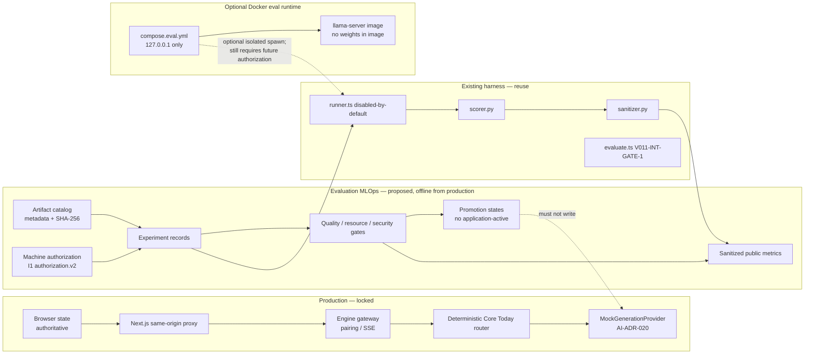

# MLOps evaluation architecture (proposed)

**Status:** proposed. Production path on the left is locked. Evaluation MLOps on the right is metadata and optional isolated runtime.

## Diagram



## Boundaries

1. **Composition root never reads the catalog.** `ai/src/config.ts` continues to force `provider: "mock"`.
2. **Authorization is a file, not a UI toggle.** Today `authorization.v2.json` has `preflight/full/operations: false`. MLOps must treat that as `stage-blocked`.
3. **Docker is not the desktop runtime.** The Windows installer and Electron shell stay on the deterministic engine only.
4. **Promotion is lineage, not serving.** `preflight-passed` or `full-eval-passed` still cannot enter `ProviderRegistry`.

## Data classes

| Record | Public Git | Local only |
|---|---|---|
| Artifact metadata (id, family, quant, license name, sha256) | Yes | — |
| Experiment header (protocol, corpus hash, stage, outcome enum) | Sanitized aggregate | Raw attempts/logs |
| Gate verdicts | Yes | Per-sample traces |
| Resource peaks | Aggregates only | nvidia-smi CSV, server.log |
| Model weights / llama binary | Never | Operator machine |
| Kaizen user state | Never | Never in eval containers |

## Trust flow

```text
current domain records
  > deterministic analytics          ← production Intelligence
  > MLOps experiment verdicts        ← evaluation commentary only
  > model inference                  ← not application-reachable
```

Experiment verdicts must never override `core.today@1.0` or Home Next Action.

## Docker/Compose constraints (if later implemented)

- Services bind `127.0.0.1`; no `0.0.0.0` publish for llama-server.
- Image contains runtime bits specified by hash, **not** GGUF weights.
- Weights mount from an ignored local path at run time.
- No Kubernetes manifests, no cloud registry push, no Compose in packaging/.
- Network: none except loopback. No volume of `localStorage`, backups, or Health data.
